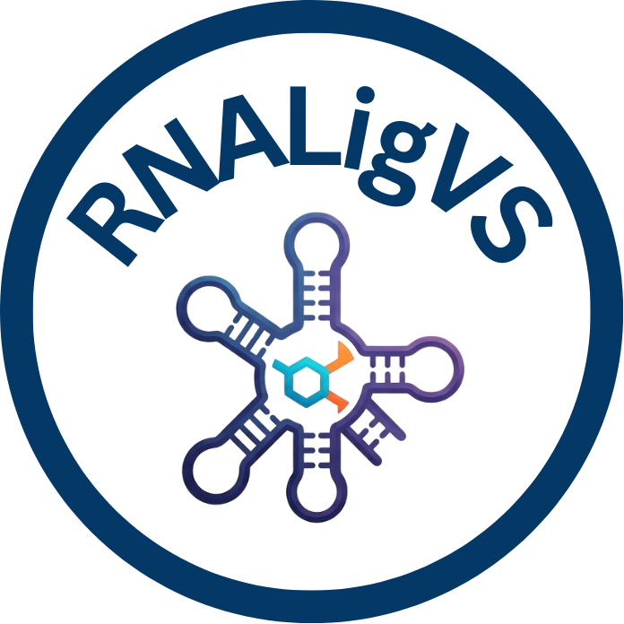

<p align="center">
  
</p>

## RNALigVS: A Physics-Guided Structure-Based Web Server for RNA–Ligand Virtual Screening

RNALigVS is a physics-guided RNA–ligand virtual screening web server integrating structural and physicochemical interaction descriptors, NeighborSearch-based pocket detection, weighted scoring, and probability-based affinity estimation for rapid RNA-targeted ligand prioritization and virtual screening.
The framework integrates:

- Contact density
- Electrostatic interactions
- Hydrogen-bond strength
- π-stacking interactions
- Pocket depth
- Structural curvature

RNALigVS employs a KD-tree accelerated NeighborSearch algorithm for efficient RNA binding pocket identification and provides rapid large-scale virtual screening capabilities.

---

# Features

- RNA-ligand virtual screening
- Physics-guided scoring framework
- KD-tree accelerated pocket detection
- Docking-free screening strategy
- Probability-based ligand ranking
- Streamlit webserver implementation
- Interactive RNA pocket visualization
- Large-scale ligand screening support

---

# Workflow

<p align="center">
  
</p>

The RNALigVS workflow includes:

1. RNA-ligand structure preprocessing
2. NeighborSearch-based binding pocket detection
3. Physicochemical feature extraction
4. Weighted scoring calculation
5. Score normalization
6. Probability-based ligand ranking

---

# Installation

## Clone Repository

```bash
git clone https://github.com/YOUR_USERNAME/RNALigVS.git
cd RNALigVS
```

## Install Dependencies

```bash
pip install -r requirements.txt
```

---

# Usage

## Feature Extraction

```bash
python Features.py
```

## Model Training

```bash
python Train_RNALigVS.py
```

## Virtual Screening Prediction

```bash
python features_rnaligvs_final.py
```

---

# Input Requirements

- RNA-ligand complex structure in PDB format
- Ligand SMILES dataset in TXT or CSV format

---

# Output

RNALigVS provides:

- Binding probability prediction
- RNALigVS score
- Ligand ranking
- Drug-likeness analysis
- Interaction profiling
- 2D ligand visualization

---

# Webserver

RNALigVS webserver is freely available at:

https://vsrnalig.streamlit.app/

---

# Performance

RNALigVS achieved:

| Metric | Training | Testing |
|---|---|---|
| Pearson Correlation | -0.93 | -0.90 |
| Spearman Correlation | -0.98 | -0.58 |

The framework also achieved:

- ROC-AUC = 0.71
- Improved runtime efficiency
- Competitive ranking against RNAmigos2 and RLDockScore

---

# Repository Structure

```text
RNALigVS/
```

---

# Citation

If you use RNALigVS in your research, please cite:

Priyanka Sharma, N. Latha, Pradeep Pant

RNALigVS: A Physics-Guided Structure-Based Web Server for Virtual Screening of RNA–Ligand Binders

---

# License

MIT License

---

# Contact

Priyanka Sharma  
Department of Biotechnology  
Bennett University  
India
